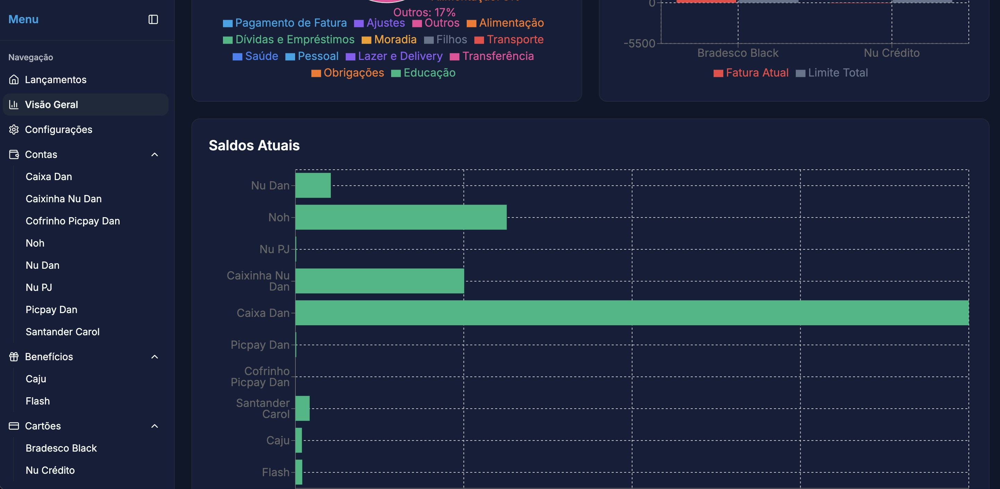

# PB Finance 💰

Bem-vindo ao **PB Finance**, o sistema definitivo de gestão financeira familiar. Este projeto foi desenvolvido para oferecer controle total sobre receitas, despesas, cartões de crédito e planejamento financeiro, tudo em uma interface moderna, responsiva e intuitiva.


*(Substitua esta imagem por um screenshot real do seu dashboard)*

## 🚀 Sobre o Projeto

O **PB Finance** nasceu da necessidade de centralizar e simplificar a gestão financeira da família. Diferente de planilhas complexas ou apps genéricos, este sistema é focado em:

*   **Multi-tenancy Familiar**: Gestão de contas e cartões compartilhados entre membros da família.
*   **Controle de Cartões**: Acompanhamento detalhado de faturas, limites e datas de fechamento.
*   **Categorização Inteligente**: Separação clara entre despesas fixas, variáveis, lazer e investimentos.
*   **Visualização de Dados**: Gráficos claros para entender para onde o dinheiro está indo.

## 🛠️ Tecnologias Utilizadas

Este projeto utiliza as tecnologias mais modernas do ecossistema React:

*   **[Vite](https://vitejs.dev/)**: Build tool ultra-rápida.
*   **[React](https://react.dev/)**: Biblioteca para construção de interfaces.
*   **[TypeScript](https://www.typescriptlang.org/)**: Segurança de tipos e melhor experiência de desenvolvimento.
*   **[Tailwind CSS](https://tailwindcss.com/)**: Estilização utilitária para design rápido e responsivo.
*   **[Shadcn/ui](https://ui.shadcn.com/)**: Componentes de UI reutilizáveis e acessíveis.
*   **[Firebase](https://firebase.google.com/)**: Backend as a Service (Auth, Firestore).
*   **[Recharts](https://recharts.org/)**: Biblioteca de gráficos para React.

## ⚙️ Como Rodar Localmente

1.  **Clone o repositório**
    ```bash
    git clone https://github.com/danbuck84/pbfinance.git
    cd pbfinance
    ```

2.  **Instale as dependências**
    ```bash
    npm install
    ```

3.  **Configure as Variáveis de Ambiente**
    Crie um arquivo `.env` na raiz do projeto (use o `.env.example` como base) e adicione suas credenciais do Firebase:
    ```env
    VITE_FIREBASE_API_KEY=sua_chave
    VITE_FIREBASE_AUTH_DOMAIN=seu_dominio
    ...
    ```

4.  **Inicie o servidor de desenvolvimento**
    ```bash
    npm run dev
    ```

## 📦 Deploy

O deploy é realizado automaticamente via **Netlify** a cada push na branch `main`.

Para configurar o deploy manualmente ou em outro ambiente:
1.  Build do projeto: `npm run build`
2.  A pasta `dist` conterá os arquivos estáticos prontos para produção.
3.  Certifique-se de configurar as variáveis de ambiente no painel do seu provedor de hospedagem.

## 📝 Licença

Este projeto é de uso privado e pessoal.

---
Desenvolvido com 💙 por Dan Buck.
